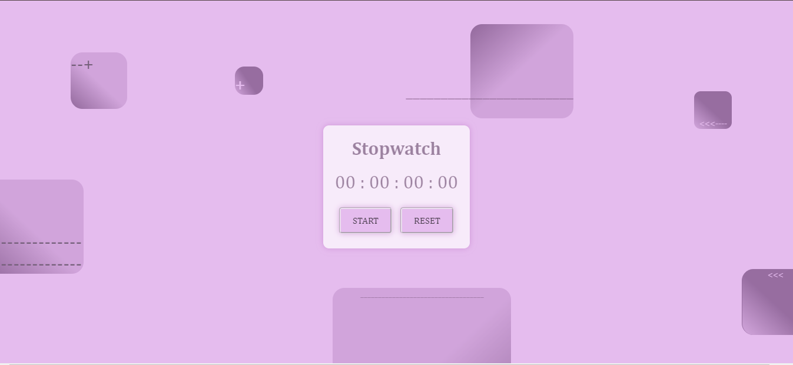
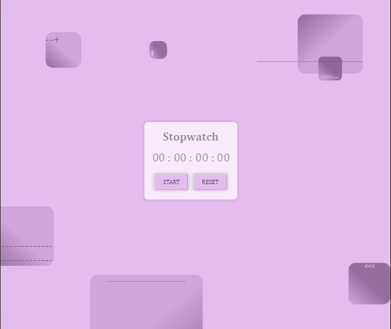
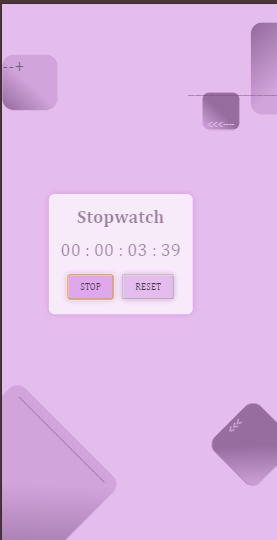

<!DOCTYPE html>
<html lang="en">
<body>
  <h1>StopWatch Task-02</h1>
  
This project based on Task-02 StopWatch component by Prodigy InfoTech.

  
  <h2>Features</h2>
  <ul>
      <li>Start, Stop, and Reset functionality</li>
      <li>Displays elapsed time in hours, minutes,seconds and milliseconds format (HH:MM:SS:mm)</li>
      <li>The basic desgin layout Desgined by Me </li>
 </ul>

 
  <h2>Language and Tools</h2>
  
Build with basic HTML ,CSS and JavaScript. 

  
  <h2>Website Link</h2>
  
<a href="https://stopwatchkhushiwala-4victorys-projects.vercel.app">stopwatch-khushiwala-4victorys-projects.vercel.app</a>

 

  <h2>Preview Images</h2>

  
Here are previews of the StopWatch on various screen sizes:

  <figure>
    <figcaption><b>Desktop Preview</b></figcaption>
    
  </figure>
  <figure>
      <figcaption><b>Tablet Preview</b></figcaption>
    
  </figure>
  <figure>
      <figcaption><b>Mobile Preview</b></figcaption>
    
  </figure>

  <i><b>
Happy coding!
</b></i>
</body>
</html>

